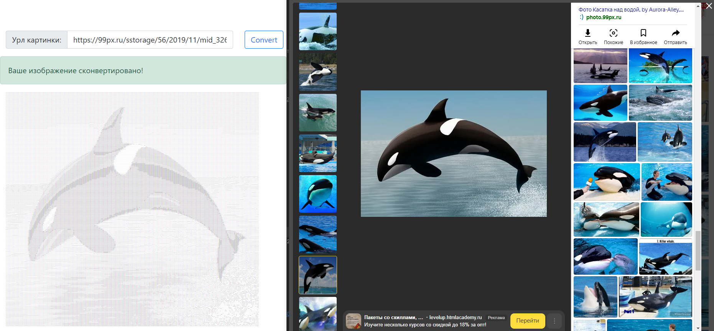

# Конвертер в текстовую графику

Курсовая работа 

Моей задачей было дописать программу конвертации изображения в строку символов, а точнее  доработка ее основной логической части в соответствии с требованиями.

Язык разработки - java.

В исходных данных я получил класс GServer, который запускает приложение в браузерном режиме и интерфейсы недостающих классов.
Я написал классы Converter, Schema.

Метод convert класса Converter принимает Url изображения и возвращает строку символов.
При конвертации проверяются пропорции изображения и выполняется масштабирование до требуемого размера.

Класс Schema подставляет символ определенной графической плотности вместо цветового писеля. "Градиент" любой длины из символов можно передать в конструкторе объекта класса.

Эстимейт работы составлял 33 часа. 

Выполнено с отладкой и тестированием за 12 часов.
